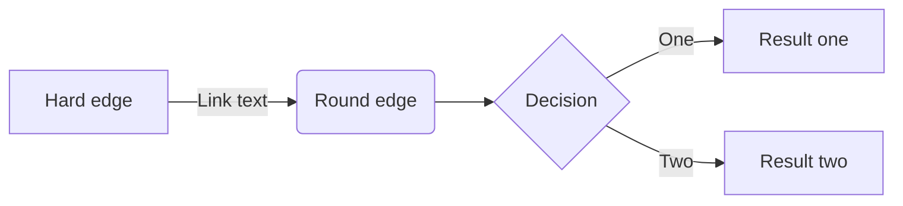

# release-99.99.99
### No issue
  
 
## Features

**blahblah**  ([ff96e5fb3f23092](http://github.com/dohyunKim12/testing_repo/commit/ff96e5fb3f23092)) *dohyunkim 2022-07-28 11:37:01*

 - *blahblah number one* 
 - *blahblah number two* 
 - *blahblah number three* 

**change mod to feat**  ([fb88be16a43b44f](http://github.com/dohyunKim12/testing_repo/commit/fb88be16a43b44f)) *dohyunkim 2022-07-28 11:31:12*


**no branch condition**  ([e645335e1de4d38](http://github.com/dohyunKim12/testing_repo/commit/e645335e1de4d38)) *dohyunkim 2022-07-28 11:26:50*


**refactoring jenkins gitchangelog**  ([9b47e5ec90b56b9](http://github.com/dohyunKim12/testing_repo/commit/9b47e5ec90b56b9)) *dohyunkim 2022-07-28 08:18:45*


  
## Refactor

**refactoring jenkinsfile**  ([5e8921a8371a382](http://github.com/dohyunKim12/testing_repo/commit/5e8921a8371a382)) *dohyunkim 2022-07-29 01:41:21*


**change blahblah**  ([310919845b933b5](http://github.com/dohyunKim12/testing_repo/commit/310919845b933b5)) *dohyunkim 2022-07-28 11:41:44*

 - *fix blahblah one*
 - *fix blahblah two*
 - *fix blahblah three*

**remove docker build & upload**  ([d2104cc82e6b71f](http://github.com/dohyunKim12/testing_repo/commit/d2104cc82e6b71f)) *dohyunkim 2022-07-28 10:29:40*

 - *exclude docker build, upload step for testing*

  
## Bug Fixes

**Fix bug by git push(fake commit)**  ([da1312c92f613ad](http://github.com/dohyunKim12/testing_repo/commit/da1312c92f613ad)) *dohyunkim 2022-07-29 03:45:52*

 - *BREAKING CHANGES: use latest jenkinsfile blahblah*

**Refactor using docker plugin**  ([72235951886e065](http://github.com/dohyunKim12/testing_repo/commit/72235951886e065)) *dohyunkim 2022-07-28 08:13:23*


 
 
# release-0.0.441
### No issue
  
 
  
  
  
# release-0.0.2
### No issue
  
 
  
  
  
# release-0.0.1
### No issue
  
 
## Features

**add HTTP(s) Server Handler / Initializer**  ([634adfb43bb51ee](http://github.com/dohyunKim12/testing_repo/commit/634adfb43bb51ee)) *gyeongyeol-choi 2022-07-01 16:00:00*



```mermaid
flowchart Lamp
    A[Lamp doesn't work] -->|Shitt| B{Lamp plugged in?}
    B -->|No| C(Plug in lamp)
    B -->|Yes| D{Bulb burned out?}
    D -->|Yes| E(Replace Bulb)
    D -->|No| F(Repair Lamp)
```
